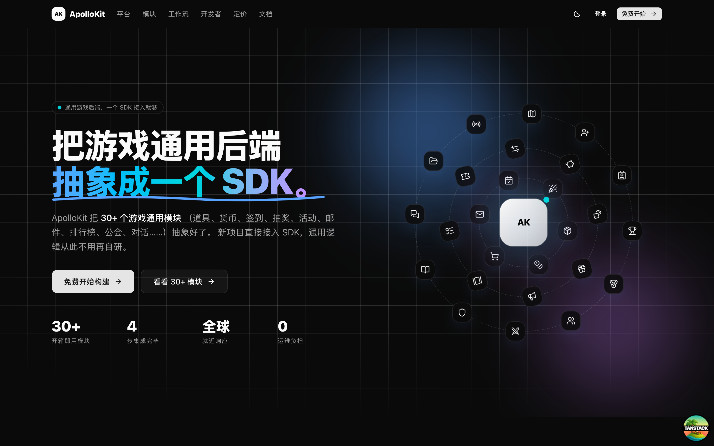
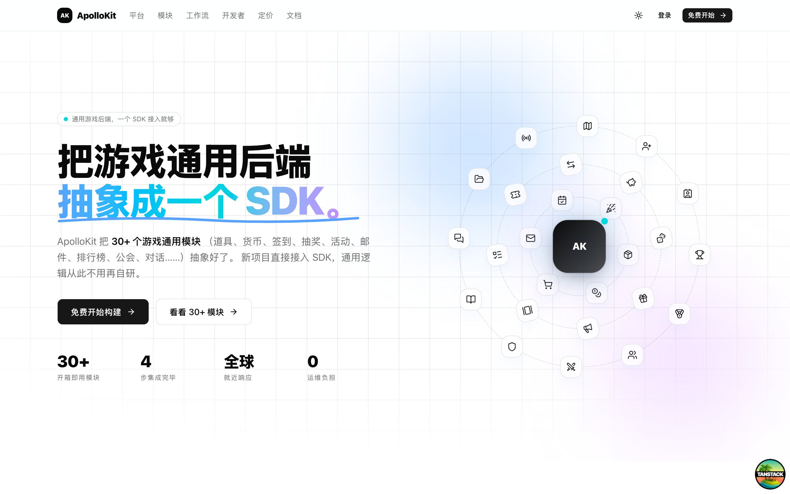
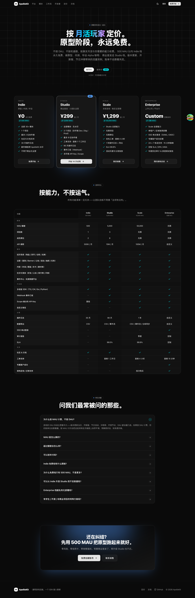
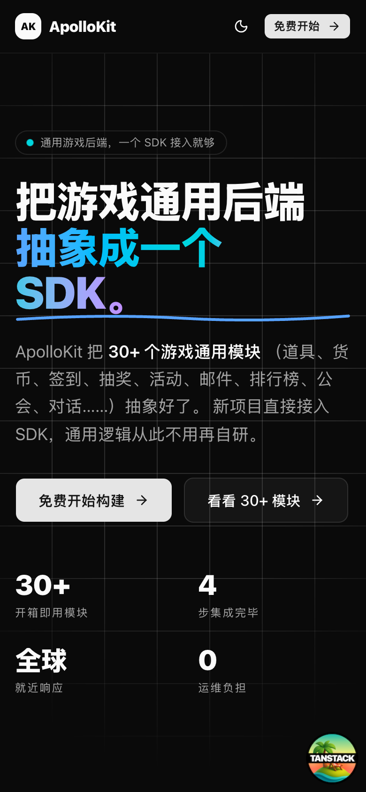

<div align="center">

# ApolloKit

**开源的游戏通用后端 · 一个 SDK，接完所有通用逻辑**

签到 · 道具 · 货币 · 活动 · 抽奖 · 邮件 · 排行榜 · 公会 · 对话 · 事件中心 ——
30+ 个游戏运营通用模块抽象成即插即用的 SDK，跑在 Cloudflare 边缘。

[](./LICENSE)
[](https://workers.cloudflare.com/)
[](https://www.typescriptlang.org/)
[](https://pnpm.io/)



</div>

---

## 是什么

**ApolloKit** 是一套开箱即用的游戏后端平台。把游戏中那些「每款都要重写一遍」的通用逻辑 —— 经济系统、运营活动、内容生产、社交竞技、埋点数据 —— 全部抽象成可配置的模块和一个类型安全的 SDK。

新项目直接接入 SDK，策划在控制台配置规则，通用后端从此不用再自研。

- **Admin 控制台**：策划和运营用的 web 界面（道具编辑、活动编排、邮件发放、埋点看板等）
- **API Server**：给游戏客户端调用的 HTTP API，自带 OpenAPI、Better Auth、Webhook 事件
- **SDK**：TypeScript 已发布，C# / Go / Python 规划中

项目采用 **monorepo**（pnpm + Turborepo）结构，整套部署在 **Cloudflare Workers** 上，数据落在 **Neon Postgres**。自托管全流程 10 分钟起。

## 包含哪些模块

| 分组     | 模块                                                     |
| -------- | -------------------------------------------------------- |
| **经济** | 物品 · 货币 · 实体 · 兑换 · CDKEY · 商城 · 存储箱 · 邮件 |
| **运营** | 签到 · 轮播图 · 公告 · 活动 · 抽奖 · 好友赠礼 · 任务     |
| **内容** | 素材云盘 · 对话 · 图鉴 · 关卡 · 事件中心                 |
| **社交** | 好友 · 邀请 · 公会 · 组队 · 排行榜 · 天梯 · 终端玩家     |
| **系统** | API Key 管理 · 多租户 · 多环境                           |

每个模块都有独立的 HTTP 端点 + 管理台页面 + SDK 方法。

## 截图一览

<table>
<tr>
<td width="50%"></td>
<td width="50%"></td>
</tr>
<tr>
<td align="center"><sub>营销首页 · 亮色</sub></td>
<td align="center"><sub>定价页 · 含功能对比表与 FAQ</sub></td>
</tr>
</table>

移动端同样优先处理：

<p align="center">
  
</p>

> 截图由 `pnpm screenshots` 生成（需要先在一个终端 `pnpm dev` 跑起来），详见 [CONTRIBUTING.md](./CONTRIBUTING.md#文档--截图)。

## 技术栈

| 层          | 技术                                                                         |
| ----------- | ---------------------------------------------------------------------------- |
| 运行时      | Cloudflare Workers（compat date `2026-04-11`, `nodejs_compat`）              |
| 前端        | TanStack Start（Vite 7 + React 19.2）· Tailwind v4 · shadcn/ui · fumadocs    |
| 后端        | Hono · `@hono/zod-openapi` · Better Auth 1.6 · Drizzle ORM 0.45              |
| 数据库      | Neon Postgres (serverless)，也可用任意 PostgreSQL                            |
| 缓存 / 限流 | Upstash Redis（可选）                                                        |
| 分析        | Tinybird（可选，事件中心埋点落库）                                           |
| 工具链      | pnpm 10.x · Turborepo 2.x · TypeScript 5.9 · ESLint 9 flat config · Prettier |

Node 版本 ≥ 18。

## 开始前，你需要准备的外部资源

ApolloKit 设计为云原生，**没有自建机器的动作**。所需的托管服务都提供免费档，原型阶段零成本跑通。

| 服务                                       | 用途                                     | 免费档                 | 必选 / 可选                     |
| ------------------------------------------ | ---------------------------------------- | ---------------------- | ------------------------------- |
| [Cloudflare](https://cloudflare.com/) 账号 | 部署 admin + server Workers              | 10 万请求/天           | **必选**                        |
| [Neon](https://neon.tech/) 账号            | Postgres 数据库（Better Auth + Drizzle） | 0.5 GB 存储 / 1 个项目 | **必选**（或自备任意 Postgres） |
| Better Auth 密钥                           | 本地生成 32-byte 随机串                  | —                      | **必选**                        |
| [Upstash Redis](https://upstash.com/)      | 限流 / 短期缓存                          | 1 万命令/天            | 可选，未配置时这些特性关闭      |
| [Tinybird](https://tinybird.co/)           | 事件中心分析落库                         | —                      | 可选，未配置时事件仅入 Postgres |

## 本地开发 Quick start

```bash
# 1. 克隆 + 装依赖
git clone https://github.com/<you>/apollokit.git
cd apollokit
pnpm install

# 2. 准备 server 环境变量
cp apps/server/.dev.vars.example apps/server/.dev.vars
# 在 apps/server/.dev.vars 里填：
#   DATABASE_URL="postgresql://..."        # Neon 连接串
#   BETTER_AUTH_SECRET="<32+ 字节随机串>"   # 用 `openssl rand -base64 32` 生成
#   BETTER_AUTH_URL="http://localhost:8787"
#   UPSTASH_REDIS_REST_URL=...             # 可选
#   UPSTASH_REDIS_REST_TOKEN=...           # 可选

# 3. 初始化数据库（对着 .dev.vars 的 DATABASE_URL 跑迁移）
pnpm --filter=server db:migrate

# 4. 跑起来
pnpm dev
#   admin  → http://localhost:3000
#   server → http://localhost:8787
```

管理台 `localhost:3000` 会先让你注册一个账号（走 Better Auth）。之后就能开始配置模块、看 OpenAPI 文档、体验 SDK 调用。

### 常用命令

| 命令                                 | 说明                                                   |
| ------------------------------------ | ------------------------------------------------------ |
| `pnpm dev`                           | 并行启动 admin 与 server                               |
| `pnpm build`                         | 构建 admin（server 直接走 wrangler，不经 turbo build） |
| `pnpm lint`                          | 全 workspace ESLint，零警告策略                        |
| `pnpm check-types`                   | 全 workspace `tsc --noEmit`                            |
| `pnpm format`                        | Prettier 格式化（不走 turbo）                          |
| `pnpm --filter=server db:generate`   | 改动 Drizzle schema 后生成迁移文件                     |
| `pnpm --filter=server db:migrate`    | 应用迁移（**禁止**用 `db:push` 强推到远端）            |
| `pnpm --filter=server db:studio`     | 本地 Drizzle Studio 查数据                             |
| `pnpm --filter=server auth:generate` | Better Auth schema 自动生成                            |
| `pnpm --filter=server cf-typegen`    | 重新生成 `CloudflareBindings` 类型                     |

## 部署到 Cloudflare

整套部署到 Cloudflare Workers 只需要两个 `wrangler deploy`。

```bash
# 一次性：登录 wrangler
pnpm dlx wrangler login

# Server（API）
cd apps/server
# 把生产 secrets 推到 Cloudflare（Worker 级，不写进 wrangler.jsonc）
wrangler secret put DATABASE_URL
wrangler secret put BETTER_AUTH_SECRET
wrangler secret put BETTER_AUTH_URL          # 你的 server Worker 公网地址
wrangler secret put UPSTASH_REDIS_REST_URL   # 可选
wrangler secret put UPSTASH_REDIS_REST_TOKEN # 可选
pnpm deploy
#   → 部署到名为 apollokit-server 的 Worker
#   → 同时注册每分钟 cron trigger（活动状态机 / 排行榜结算等）

# Admin（控制台 + 营销站）
cd ../admin
pnpm deploy
#   → `vite build` + `wrangler deploy`
#   → 部署到名为 apollokit-admin 的 Worker
```

部署后：

- Server Worker 暴露给游戏客户端与 admin 使用
- Admin Worker 就是你的 web 控制台，按正常域名绑定即可

Worker 名称与域名可以在 `apps/*/wrangler.jsonc` 中改。多环境部署（staging / prod）可以用 `wrangler deploy --env staging` + 对应 env 块，同一份代码跑两套 Worker + 两套 Neon 分支。

### 自备数据库

不想用 Neon？任何 PostgreSQL 都可以——只需把 `DATABASE_URL` 指向你的实例（Supabase / RDS / 自建均可）。`@neondatabase/serverless` 驱动兼容标准 Postgres 协议，但在 Cloudflare Workers 上推荐使用支持 HTTP 或连接池（PgBouncer）的服务端，直连会有冷启动问题。

## 项目结构

```
apollokit/
├── apps/
│   ├── admin/          TanStack Start · Vite + React 19 · Tailwind v4
│   │   ├── src/routes/      文件路由（/ / /pricing / /auth/... / /_dashboard/...）
│   │   ├── src/components/  landing · pricing · 30+ 模块 UI
│   │   └── wrangler.jsonc   部署到 apollokit-admin
│   └── server/         Hono · Zod OpenAPI · Better Auth · Drizzle
│       ├── src/              HTTP handlers / scheduled handler
│       ├── drizzle/          迁移文件
│       ├── .dev.vars.example 本地开发环境模板
│       └── wrangler.jsonc    部署到 apollokit-server + 每分钟 cron
├── packages/
│   ├── ui/                @repo/ui — 共享 React 源码组件（无 build 步骤）
│   ├── eslint-config/     @repo/eslint-config — base · next-js · react-internal
│   └── typescript-config/ @repo/typescript-config — tsconfig 基座
├── AGENTS.md           给 AI 代理的完整上下文（项目历史、命令、约定）
└── turbo.json          turbo 任务定义（dev/build/lint/check-types）
```

## 贡献

欢迎 issue 和 PR。提交前请至少确保：

```bash
pnpm lint && pnpm check-types
```

Schema 改动必须走 `pnpm --filter=server db:generate` 生成迁移文件入库，**不要**用 `db:push` 强推远端。

完整贡献指南见 [`CONTRIBUTING.md`](./CONTRIBUTING.md) —— 分支策略、Conventional Commits 规范、模块贡献流程、Changesets 发布、安全报告。

项目历史与 AI 代理上下文见 [`AGENTS.md`](./AGENTS.md)。

## License

[MIT](./LICENSE) — 商业友好，随便用。希望你用它做出好玩的游戏。
