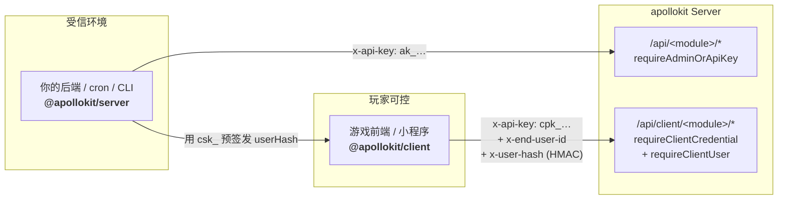

apollokit 提供两个 TypeScript SDK，鉴权方式和适用场景完全不同。**绝不要混用**。

<Cards>
  <Card
    title="@apollokit/server"
    href="/docs/zh/sdk/server-typescript"
    description="服务端到服务端调用 — 后端脚本、运营工具、数据管道。鉴权用 ak_ admin API key（组织级权限）。"
  />
  <Card
    title="@apollokit/client"
    href="/docs/zh/sdk/client-typescript"
    description="终端用户场景 — 游戏前端、H5、Electron。鉴权用 cpk_ publishable key + HMAC（按用户授权）。"
  />
  <Card
    title="Unity / C# (规划中)"
    href="/docs/zh/sdk"
    description="跟 client SDK 走同一套 cpk_ + HMAC 协议。当前阶段未发布，跟踪 plan §阶段 4。"
  />
  <Card
    title="curl / 其它语言"
    href="/docs/zh/api"
    description="API reference 的每个 endpoint 页都有 curl + TS 多语言 Tab。其它语言（Python / Go）发布前先按 curl 模板自行包装。"
  />
</Cards>

## 整体架构



`ak_` 永远不下发到玩家可控的进程;`cpk_` 是公钥可以打包,但配套的 `csk_` 只能在 BE 端用,通过预签发 `userHash` 把"用户授权"传给 GAME。

## 选哪个

<Callout type="warn" title="安全边界 — server SDK 永远不要进客户端">

`ak_` 开头的 admin API key 是**组织级密钥**，能调任何 admin 路由（创建配置、修改商品、签发奖励等）。一旦泄露到游戏客户端、H5 包、版本控制，攻击者就能伪造任何运营操作。

如果你在 Unity / 浏览器 / 小程序 / 玩家可控的进程里写代码，**永远用 `@apollokit/client`**，配 `cpk_` + 后端签发的 HMAC。`csk_` 也只能放服务端。

</Callout>

| | Server SDK | Client SDK |
|---|---|---|
| **包名** | `@apollokit/server` | `@apollokit/client` |
| **鉴权** | `x-api-key: ak_…` | `x-api-key: cpk_…` + `x-end-user-id` + `x-user-hash` (HMAC-SHA256) |
| **路由前缀** | `/api/*` (admin) | `/api/client/*` |
| **端用户** | 不感知 — 操作整个组织 | 必带，路由按 endUserId 隔离 |
| **典型使用** | Node 后端 / cron / CLI / 数据导出 | 游戏客户端 / 小程序 / 浏览器 H5 |

## 30 秒接入预览

下面是 server SDK 的最小接入。注意代码块右上角的 **TS** 类型悬浮 — 鼠标 hover `createServerClient` 或 `announcementAdminGetRoot` 能看到完整类型签名（由 fumadocs-twoslash 编译期注入）。

```ts twoslash
import {
  createServerClient,
  announcementAdminGetRoot,
} from '@apollokit/server'

createServerClient({
  baseUrl: 'https://api.example.com',
  apiKey: process.env.APOLLOKIT_ADMIN_KEY!, // "ak_..."
})

const { data } = await announcementAdminGetRoot({ throwOnError: true })
//      ^?
const announcements = data[200].data
console.log(announcements.items.length)
```

## `createServerClient` 配置项

下面这张表是从 `@apollokit/server` 的 TypeScript 类型 **自动生成** 的（fumadocs-typescript），SDK 类型变化时这里会跟着刷新。

<AutoTypeTable
  type={`export interface ApolloKitServerConfig {
  /** Server base URL (e.g. "https://api.example.com"). */
  baseUrl: string;
  /**
   * Admin API key (\`ak_…\` prefix) issued from the dashboard's
   * \`/api-keys\` page or via \`POST /api/auth/api-key\` (configId=\`admin\`).
   * Carries full organization-level authority.
   */
  apiKey: string;
}`}
/>

## 错误模型

所有 4xx / 5xx 在 `throwOnError: true` 模式下抛 `ApolloKitApiError`：

```ts twoslash
import {
  ApolloKitApiError,
  checkInGetConfigs,
  createServerClient,
} from '@apollokit/server'

createServerClient({
  baseUrl: 'https://api.example.com',
  apiKey: 'ak_demo',
})

try {
  await checkInGetConfigs({ throwOnError: true })
} catch (err) {
  if (err instanceof ApolloKitApiError) {
    // err.code      → "check_in.config_not_found", "validation_error", ...
    // err.status    → HTTP 状态码
    // err.requestId → 粘贴到追踪面板查整链路
    console.error(`[${err.status}] ${err.code}: ${err.message}`)
  }
  throw err
}
```

<Callout type="info" title="requestId 全链路追踪">

`ApolloKitApiError.requestId` 跟 server 端 Tinybird 的 `http_requests.trace_id` 同一个值。报障时把 requestId 一起贴出来，能直接定位 server 这条请求的完整日志、上下游链路、耗时分布。

</Callout>

## 后续

- 详细接入 + 各模块 quickstart：见 [`@apollokit/server` 接入](/docs/zh/sdk/server-typescript)（plan §阶段 2 PR）
- API 完整参考：[API Reference](/docs/zh/api) — 每个 endpoint 都有 curl + TS 双 Tab，可以直接复制
